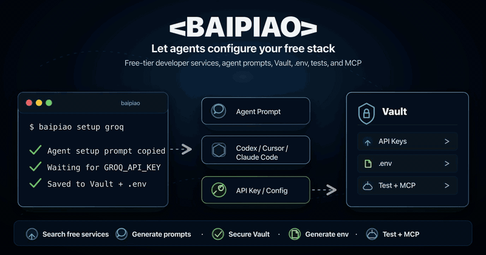
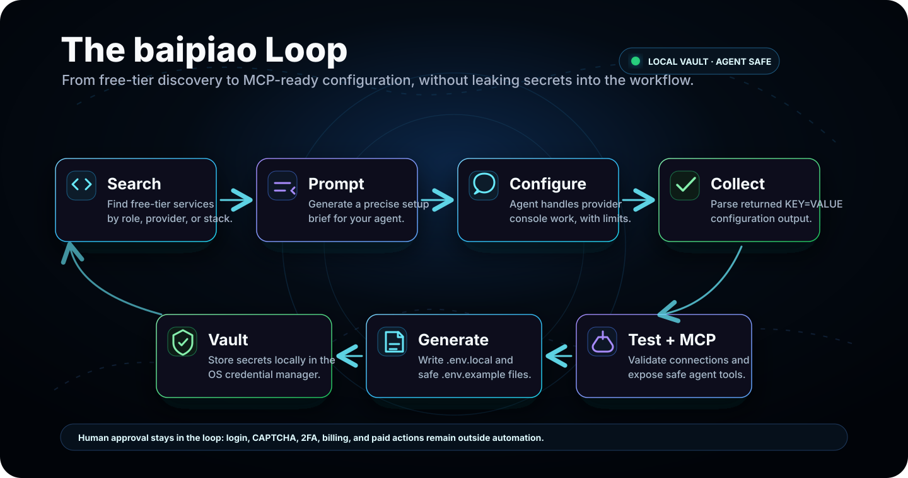
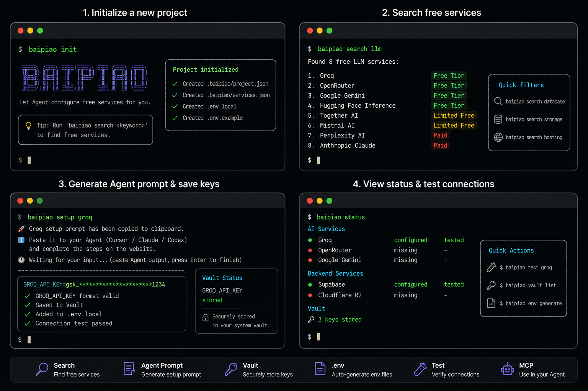
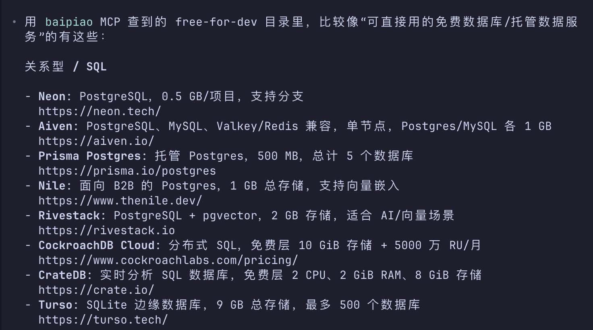

# baipiao

**Un configurateur de stack gratuite, agent-native, pour développeurs.**


[Website](https://baipiao.counterxing.top) · [Documentation](https://baipiao.counterxing.top/docs/fr) · [English](./README.md) · [中文](./README_zh.md) · [日本語](./README_ja.md) · [한국어](./README_ko.md) · [Français](./README_fr.md) · [Español](./README_es.md)

baipiao organise l’infrastructure gratuite pour développeurs et la transforme en un flux de travail clair, assisté par un agent.

Vous découvrez des services gratuits, générez un prompt de configuration précis, le confiez à Codex / Claude Code / Cursor, récupérez les clés, les enregistrez dans un Vault local, générez `.env`, testez la connexion et exposez le tout via MCP.



## Why It Exists

Les offres gratuites permettent d’aller très loin: API LLM, bases de données, stockage d’objets, hébergement, auth, email, monitoring, bases vectorielles, et plus encore.

Le problème n’est pas l’absence de services. Le problème est la friction opérationnelle.

Chaque service a sa console, sa page de clés API, son modèle de quota, son onboarding, son format de variables d’environnement et ses conventions de sécurité. Les agents IA peuvent aider, mais ils ont besoin d’une tâche structurée, d’une frontière sûre, et d’un endroit pour renvoyer le résultat.

baipiao est cette couche de contrôle.

## The Loop



## Product Principles

- **Agent-first, human-approved**: baipiao prépare le travail; l’utilisateur garde le contrôle sur la connexion, la vérification et les actions sensibles.
- **Local by default**: les secrets vivent dans le stockage local des identifiants, pas dans un tableau de bord hébergé.
- **Prompt to production**: les prompts générés ne sont pas des notes, mais des briefings exécutables pour les agents.
- **Structured where it matters**: les services connus obtiennent validation, génération de env, tests de connexion et affichage d’état plus sûr.
- **MCP-native**: Codex, Claude Code, Cursor et les autres clients MCP peuvent appeler baipiao sans recevoir de secrets en clair.

## What It Does

| Capability | Description |
|---|---|
| Service catalog | Recherche de services gratuits pour l’IA, le backend, l’hébergement, le stockage, l’authentification, etc. |
| Full catalog localization | Recherche par mot-clé/catégorie et import des traductions zh-CN / ja / ko / fr / es. |
| Agent setup prompts | Génération d’instructions de configuration spécifiques à chaque service. |
| Agent output parser | Réception de sorties `KEY=VALUE` et normalisation de la configuration. |
| Local Vault | Stockage des clés API, jetons, endpoints, identifiants de projet et chaînes de connexion dans le stockage système. |
| Env generation | Création de `.env.local` et `.env.example` à partir des données stockées. |
| Connection tests | Vérification des services pris en charge avant intégration. |
| MCP server | Exposition des outils setup / registry / Vault / env / test / status. |

## Quick Start

```bash
npm i -g baipiao
```

Ou lancez-le directement:

```bash
npx baipiao init
```

Si vous travaillez depuis un checkout local et n’avez pas encore de binaire global `baipiao`, utilisez le point d’entrée CLI compilé:

```bash
pnpm build
node packages/cli/dist/index.js init
```

Ensuite:

```bash
baipiao init
baipiao search llm
baipiao search openruter
baipiao search database
baipiao setup groq
baipiao vault list
baipiao env generate
baipiao test groq
baipiao status
```

## CLI Preview



## Intégration MCP

Avec MCP, Codex, Claude Code, Cursor et d’autres clients Agent peuvent interroger le catalogue complet importé depuis free-for-dev, inspecter les candidats localisés, générer des prompts de configuration et lire l’état sécurisé du projet sans recevoir de secrets en clair.



## Example Flow

```bash
baipiao search llm
```

```text
Groq              configurable / testable
OpenRouter        configurable / testable
Gemini            configurable / testable
Hugging Face      prompt-ready
Together AI       prompt-ready
```

Générez un prompt de configuration:

```bash
baipiao setup groq
```

baipiao transmet un prompt dédié au service à votre agent. Une fois la configuration web terminée, l’agent renvoie :

```env
GROQ_API_KEY=gsk_xxx
```

baipiao valide ensuite, stocke, écrit et teste le résultat:

```text
✓ GROQ_API_KEY format valid
✓ Saved to Vault
✓ Added to .env.local
✓ Connection test passed
```

## Vault

baipiao traite les secrets comme une infrastructure produit, pas comme des résidus de presse-papiers.

```bash
baipiao vault list
baipiao vault set GROQ_API_KEY
baipiao vault import
baipiao vault copy GROQ_API_KEY
baipiao vault reveal GROQ_API_KEY
baipiao vault health
```

Stockage par défaut:

| Platform | Store |
|---|---|
| macOS | Keychain |
| Windows | Credential Manager |
| Linux | Secret Service |

Règles de sécurité:

- `vault list` n’affiche jamais les valeurs brutes.
- `vault copy` utilise le presse-papiers au lieu du terminal.
- `vault reveal` demande une confirmation explicite.
- Les outils MCP n’exposent pas de secret en clair.
- Les logs et états générés sont conçus pour éviter toute fuite de clés.

## MCP

Démarrez le serveur MCP:

```bash
baipiao mcp
```

Installez-le dans un client:

```bash
baipiao mcp install cursor
baipiao mcp install claude
baipiao mcp install codex
```

Exemple de configuration client:

```json
{
  "mcpServers": {
    "baipiao": {
      "command": "baipiao",
      "args": ["mcp"]
    }
  }
}
```

Familles d’outils MCP disponibles:

```text
services
full catalog
setup prompts
agent output parsing
vault management
env generation
connection testing
project status
stack recommendation
```

MCP ne fournit volontairement pas d’outils comme `vault_reveal`, `get_secret_value`, le contrôle du navigateur, l’exécution shell ou l’upload de secrets.

## Boundaries

baipiao ne fait pas:

- Stocker les mots de passe de connexion web.
- Contourner CAPTCHA, 2FA, vérification téléphonique ou contrôles de risque.
- Créer des comptes automatiquement.
- Cliquer sur Billing, Upgrade, Payment, Subscribe ou sur les actions payantes.
- Uploader des secrets vers un service baipiao distant.

## Disclaimer

baipiao est un outil indépendant pour développeurs et n’est pas affilié aux services tiers qu’il peut référencer. La disponibilité des offres gratuites, les quotas, les tarifs, le comportement des API et les conditions des fournisseurs peuvent changer à tout moment.

Vous êtes responsable de vérifier les conditions de chaque fournisseur, de protéger vos identifiants et de décider quelles actions un agent est autorisé à effectuer. baipiao aide à structurer les workflows de configuration, mais ne garantit ni disponibilité, ni gratuité, ni conformité sécurité, ni adéquation juridique.

## Development

```bash
pnpm install
pnpm build
pnpm test
pnpm lint
pnpm docs:dev
```

Project docs:

- [Documentation index](./docs/INDEX.md)
- [Architecture](./docs/ARCHITECTURE.md)
- [API / Vault / MCP](./docs/API_AND_VAULT.md)
- [Data sources, normalization, prompts, and MCP flow](./docs/DATA_SOURCES_AND_PROMPTS.md)
- [Website and docs design](./docs/WEBSITE_AND_DOCS.md)

## License

MIT

## Acknowledgements

Le catalogue complet de candidats gratuits de baipiao est inspiré de free-for-dev et dérivé de ses données.
