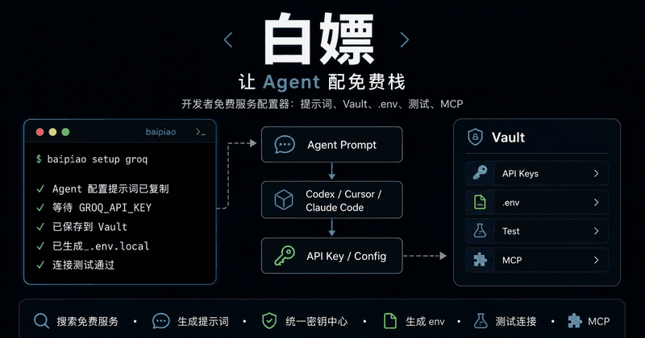
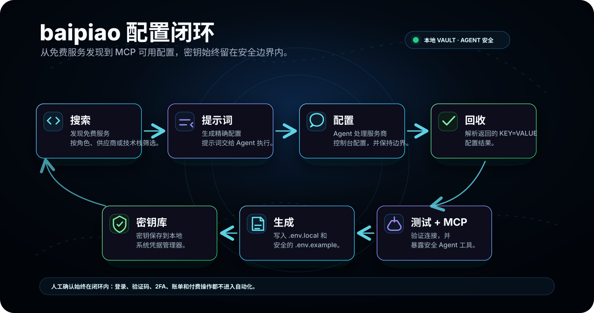

# baipiao

**面向开发者的 Agent-native 免费技术栈配置器。**


[官网](https://baipiao.counterxing.top) · [文档](https://baipiao.counterxing.top/docs) · [English](./README.md)

语言切换：[English](./README.md) · [中文](./README_zh.md) · [日本語](./README_ja.md) · [한국어](./README_ko.md) · [Français](./README_fr.md) · [Español](./README_es.md)

baipiao 把拼装免费开发基础设施这件琐碎事，整理成一个清晰、可控、可交给 Agent 协作的工作流。

搜索免费服务，生成精确的配置提示词，交给 Codex / Claude Code / Cursor 执行，然后让 baipiao 接收返回的 Key，存入本地 Vault，生成 `.env`，测试连接，并通过 MCP 暴露给后续开发流程。



## 它解决什么

今天的开发者可以靠免费额度走很远：LLM API、数据库、对象存储、Hosting、Auth、Email、Monitoring、Vector DB 等等。

问题不是找不到这些服务，而是配置过程有太多摩擦。

每个服务都有不同的控制台、API Key 页面、额度模型、开通流程、环境变量格式和安全约定。AI 编程 Agent 能帮忙，但它需要结构化任务、安全边界，以及一个可靠的位置把结果交回来。

baipiao 就是这层控制面。

## 配置闭环



## 产品原则

- **Agent-first，人类确认**：baipiao 准备工作，登录、验证和敏感操作仍由用户掌控。
- **本地优先**：密钥存入本机系统凭据管理器，而不是托管控制台。
- **从 Prompt 到可用配置**：生成的提示词不是备忘录，而是给编程 Agent 的可执行配置任务。
- **关键处结构化**：已知服务具备校验、env 生成、连接测试和更安全的状态展示。
- **MCP-native**：Codex、Claude Code、Cursor 和其他 MCP 客户端可以调用 baipiao，而不会拿到明文密钥。

## 核心能力

| 能力 | 说明 |
|---|---|
| 服务目录 | 搜索 AI、后端、Hosting、Storage、Auth 等类别的免费开发者服务。 |
| 全量目录本地化 | 按关键词/分类查询 free-for-dev 候选库，并支持 zh-CN、ja、ko、fr、es 离线翻译导入。 |
| Agent 配置提示词 | 为具体服务生成面向浏览器配置流程的 Agent 指令。 |
| Agent 输出解析 | 接收 Agent 返回的 `KEY=VALUE`，并标准化配置结果。 |
| 本地 Vault | 将 API Key、Token、Endpoint、Project ID 和连接串存入系统凭据管理器。 |
| Env 生成 | 从已保存配置生成 `.env.local` 和 `.env.example`。 |
| 连接测试 | 在服务进入项目技术栈前，测试已支持服务的连接状态。 |
| MCP server | 向 Agent 客户端暴露安全的 setup、registry、Vault、env、test 和 status 工具。 |

## 快速开始

```bash
npm i -g baipiao
```

或直接运行：

```bash
npx baipiao init
```

然后：

```bash
baipiao init
baipiao search llm
baipiao search openruter
baipiao search 数据库
baipiao setup groq
baipiao vault list
baipiao env generate
baipiao test groq
baipiao status
```

## CLI 预览


## MCP 接入

通过 MCP，Codex、Claude Code、Cursor 和其他 Agent 客户端可以查询全量导入的 free-for-dev 候选目录、查看本地化候选项、生成配置提示词，并读取安全的项目状态，同时不会拿到明文密钥。


## 示例流程

```bash
baipiao search llm
```

```text
Groq              configurable / testable
OpenRouter        configurable / testable
Gemini            configurable / testable
Hugging Face      prompt-ready
Together AI       prompt-ready
```

生成配置提示词：

```bash
baipiao setup groq
```

baipiao 会复制一段服务专用提示词给你的 Agent。Agent 完成网页配置任务后，返回：

```env
GROQ_API_KEY=gsk_xxx
```

随后 baipiao 会校验、保存、写入并测试：

```text
✓ GROQ_API_KEY format valid
✓ Saved to Vault
✓ Added to .env.local
✓ Connection test passed
```

## Vault

baipiao 把密钥当作产品基础设施管理，而不是散落在剪贴板里的临时文本。

```bash
baipiao vault list
baipiao vault set GROQ_API_KEY
baipiao vault import
baipiao vault copy GROQ_API_KEY
baipiao vault reveal GROQ_API_KEY
baipiao vault health
```

默认存储位置：

| 平台 | 存储 |
|---|---|
| macOS | Keychain |
| Windows | Credential Manager |
| Linux | Secret Service |

安全规则：

- `vault list` 永远不打印明文密钥。
- `vault copy` 使用剪贴板，而不是终端输出。
- `vault reveal` 需要显式确认。
- MCP 工具不暴露明文 reveal 操作。
- 日志和状态输出会尽量避免泄露 Key。

## MCP

启动 MCP server：

```bash
baipiao mcp
```

安装到客户端：

```bash
baipiao mcp install cursor
baipiao mcp install claude
baipiao mcp install codex
```

`install` 会直接更新目标客户端配置。你也可以复制这份手动配置 map：

```json
{
  "mcpServers": {
    "baipiao": {
      "command": "baipiao",
      "args": ["mcp"]
    }
  }
}
```

可用 MCP 工具族：

```text
services
full catalog
setup prompts
agent output parsing
vault management
env generation
connection testing
project status
stack recommendation
```

MCP 会刻意避免提供 `vault_reveal`、`get_secret_value`、浏览器控制、shell 执行或密钥上传等工具。

## 安全边界

baipiao 不会：

- 保存网页登录密码。
- 绕过 CAPTCHA、2FA、手机验证或服务商风控。
- 自动注册账号。
- 点击账单、升级、付款、订阅或付费套餐操作。
- 把密钥上传到远程 baipiao 服务。

## 免责声明

baipiao 是独立开发者工具，与它引用或帮助配置的第三方服务没有从属或官方合作关系。免费额度、配额、价格、API 行为和服务条款都可能随时变化。

你需要自行确认每个服务商的条款、保护自己的凭据，并决定允许 Agent 执行哪些操作。baipiao 只帮助结构化配置流程，不承诺服务一定可用、一定免费、满足特定安全合规要求，或适合你的具体法律/业务场景。

## 开发

```bash
pnpm install
pnpm build
pnpm test
pnpm lint
pnpm docs:dev
```

项目文档：

- [文档索引](./docs/INDEX.md)
- [技术架构](./docs/ARCHITECTURE.md)
- [API / Vault / MCP](./docs/API_AND_VAULT.md)
- [数据源、Normalize、Prompt 与 MCP 流程](./docs/DATA_SOURCES_AND_PROMPTS.md)
- [落地页与文档站设计](./docs/WEBSITE_AND_DOCS.md)

## 许可证

MIT

## 鸣谢

baipiao 的全量免费服务候选目录借鉴并派生自 free-for-dev。
